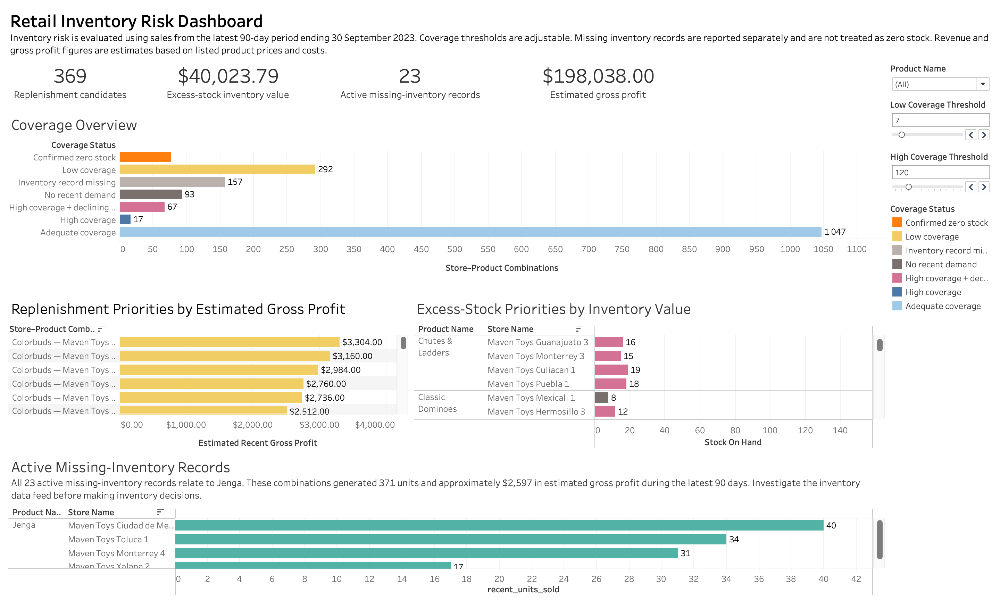

# Retail Inventory Risk Analysis

## Project Overview

This portfolio project analyses recent product demand and current inventory across 50 toy stores in Mexico. The objective is to help the Head of Commercial Controlling identify store–product combinations that may require replenishment, inventory transfer, reduced future purchasing, or further data investigation.

The analysis combines Python-based data auditing, PostgreSQL analysis, and an interactive Tableau dashboard. Inventory risk is evaluated relative to recent demand rather than by using the same absolute stock quantity for every product.


**[View the interactive dashboard on Tableau Public](https://public.tableau.com/views/InventoryRiskScreeningMexicoToyRetail/InventoryRiskDashboard?:language=en-US&:sid=&:redirect=auth&:display_count=n&:origin=viz_share_link)** 

## Business Questions

1. Which store–product combinations have zero stock or low stock coverage and should be reviewed for replenishment?
2. Which combinations have high stock coverage, declining demand, or no recent demand and should be reviewed for inventory transfer or reduced purchasing?
3. Which missing inventory records affect products that still generated recent sales and therefore require data investigation?
4. Which inventory risks should management prioritise based on estimated gross profit and inventory value at cost?

## Key Findings

Using a default low-coverage threshold of 7 days and a high-coverage threshold of 120 days:

- **369 replenishment candidates** were identified, including 77 confirmed zero-stock combinations and 292 low-coverage combinations.
- These replenishment candidates generated approximately **$198,038 in estimated gross profit** during the latest 90-day period.
- **177 excess-stock candidates** held approximately **$40,023.79 in inventory value at cost**.
- **157 store–product combinations** had no inventory record and were kept separate from confirmed zero stock.
- **23 missing-inventory combinations had recent sales**. All related to **Jenga**, generated 371 recent units, and represented approximately **$2,597 in estimated gross profit**.

The replenishment opportunity ($198K) is roughly five times the size of the excess-stock exposure ($40K) — stockouts are the bigger lever here, though both are worth acting on.

These results are screening indicators, not automatic purchasing instructions. Final decisions require information that is unavailable in the dataset, such as supplier lead times, safety-stock targets, open purchase orders, and minimum order quantities.

## Dashboard

The Tableau dashboard contains four decision-focused sections:

- **Coverage Overview** — shows the number of store–product combinations in each inventory-risk status, ordered by risk severity (confirmed zero stock through adequate coverage) rather than alphabetically.
- **Replenishment Candidates** — ranks confirmed zero-stock and low-coverage combinations by their estimated recent gross-profit contribution.
- **Excess-Stock Priorities by Inventory Value** — highlights high-coverage and no-demand combinations with capital tied up in inventory.
- **Active Missing-Inventory Records** — reports recent demand for combinations whose inventory status is unknown.

Four KPI tiles summarise replenishment opportunity, excess-stock value, missing-inventory records, and estimated gross profit at a glance.

Users can select a product and adjust the low- and high-coverage thresholds to explore different inventory-risk scenarios.

## Methodology

### Analysis periods

- **Recent period:** 3 July 2023–30 September 2023
- **Previous comparison period:** 4 April 2023–2 July 2023
- Each period contains 90 calendar days.

### Core calculations

**Average daily units sold**

```text
Recent units sold / 90 days
```

**Days of stock coverage**

```text
Stock on hand / average daily units sold
```

**Unit margin**

```text
Listed product price - listed product cost
```

**Estimated recent gross profit**

```text
Recent units sold × unit margin
```

**Inventory value at cost**

```text
Stock on hand × listed product cost
```

### Inventory classification

- **Confirmed zero stock:** an inventory record exists and stock on hand equals zero.
- **Low coverage:** positive stock with coverage below the selected low threshold.
- **Adequate coverage:** coverage falls between the selected low and high thresholds.
- **High coverage:** coverage exceeds the selected high threshold.
- **High coverage with declining demand:** high coverage combined with lower recent demand than in the previous 90-day period.
- **No recent demand:** an inventory record exists, but no units were sold during the recent period.
- **Inventory record missing:** no inventory record exists for the store–product combination; the value is unknown and is not converted to zero.

The default Tableau thresholds are scenario-based screening rules and can be changed by the user. They are not claimed to be official company inventory policies.

## Data Quality and Validation

The Python audit checks:

- missing values and duplicate records;
- uniqueness of product, store, sale, and calendar identifiers;
- numeric price, cost, units, and stock rules;
- valid product and store relationships across tables;
- date conversion and calendar completeness;
- sales recorded before a store's opening date;
- completeness of the inventory store–product grid.

The most important data-quality issue is the distinction between **missing inventory records** and **confirmed zero stock**. Treating the 157 missing combinations as zero stock would materially distort the replenishment analysis.

## Tools Used

- **Python and pandas** — data inspection, cleaning, validation, and export
- **Jupyter Notebook in VS Code** — documented data-audit workflow
- **PostgreSQL and pgAdmin** — relational data model, joins, calculations, and analytical view
- **SQL** — demand aggregation, inventory coverage, profitability estimates, and data-quality logic
- **Tableau Public** — interactive inventory-risk dashboard
- **Git and GitHub** — version control and portfolio presentation

## Repository Structure

```text
retail-profitability-analysis/
├── notebooks/
│   └── 01_data_audit.ipynb                    # Data inspection, cleaning, and validation
├── sql/
│   ├── 01_create_tables.sql
│   ├── 02_inventory_risk_analysis.sql
│   ├── 03_create_analysis_view.sql
│   └── 04_executive_kpis.sql
├── screenshots/
│   └── inventory_risk_dashboard.png           # Dashboard preview image
├── tableau/
│   └── inventory_risk_analysis.csv            # Exported vw_inventory_risk_analysis view (Tableau data source)
├── retail_inventory_risk_dashboard.twbx        # Packaged workbook (includes the extract)
├── data_dictionary.csv                         # Field reference for the source dataset
├── LICENSE
└── README.md
```

The original source CSVs (`sales.csv`, `inventory.csv`, `products.csv`, `stores.csv`, `calendar.csv`) and the notebook's cleaned/processed output are not stored in this repository — they're a public dataset (one file alone is over 20 MB) and are fully reproducible by running the notebook. Download the source files directly from Maven Analytics using the link below; `data_dictionary.csv` is kept in the repo for quick reference.

## How to Reproduce the Project

1. Download the [Mexico Toy Sales dataset from Maven Analytics](https://mavenanalytics.io/data-playground/mexico-toy-sales).
2. Place the source CSV files in a local `data/raw/` folder for your own working copy (this folder is not part of the repository — see note above).
3. Open and run `notebooks/01_data_audit.ipynb` to reproduce the audit and export cleaned CSV files locally.
4. Create the PostgreSQL tables using the SQL scripts in `sql/`.
5. Import the notebook's cleaned CSV output into PostgreSQL.
6. Run the analytical SQL scripts to create the inventory-risk view.
7. Export the view as `tableau/inventory_risk_analysis.csv` and use it as the Tableau data source.
8. Open `retail_inventory_risk_dashboard.twbx` in Tableau Public or Tableau Desktop.

## Recommendations

- Review zero-stock and low-coverage combinations with the highest estimated gross-profit contribution first.
- Investigate whether inventory can be transferred between stores before placing new purchase orders.
- Review high-coverage, declining-demand, and no-demand combinations for reduced purchasing, transfer, or promotional action.
- Investigate the missing Jenga inventory records before treating them as replenishment needs or available stock.
- Add supplier lead times, safety-stock targets, purchase orders, and historical inventory snapshots before developing definitive reorder recommendations.

## Limitations

- The inventory table has no explicit snapshot date; the analysis assumes it approximately represents inventory at the end of the sales period on 30 September 2023.
- Historical inventory levels, stockout dates, lost sales, supplier lead times, safety stock, open purchase orders, and minimum order quantities are unavailable.
- Revenue and gross profit are estimates based on listed product prices and costs. The dataset does not contain transaction-level discounts or actual realised margins.
- The 90-day demand window may not capture every seasonal pattern.
- Global coverage thresholds are used for interactive scenario screening and may require product-specific adjustment in a real business environment.

## Data Source

Mexico Toy Sales dataset provided by [Maven Analytics](https://mavenanalytics.io/data-playground/mexico-toy-sales).

